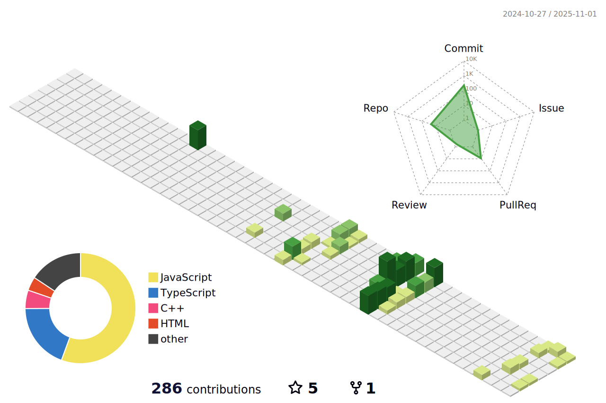

<h1 align="center">Hey 👋, I'm Sahil Pal</h1>
<h3 align="center">🚀 Full Stack Developer | React Native Enthusiast | Open Source Contributor</h3>

<p align="center">

</p>

---


- 🌱 Learning DevOps, Microservices, and React Native (TS)
- 🛠️ Love building full-stack MERN apps and SaaS tools
- 💬 Ask me about **React, Firebase, MongoDB, Git**
- 🎯 Goal: Contribute to impactful open source projects
- ⚡ Fun fact: I learn faster when building real projects!

---

### 🧠 Tech Stack

#### 👨‍💻 Programming Languages


#### 🌐 Web & Backend Development


#### 📱 Mobile & UI Tools


#### ⚙️ DevOps & Tools


#### 🧠 Web3 / Blockchain


#### 🎨 3D, Animation & Design


---

### 📊 Most Used Languages

<p align="center">
  
</p>

---

### 📊 GitHub Stats

<p align="center">
  
  
</p>

---

### 🔥 Contribution Activity

<p align="center">
 
</p>

---

## 🌐 Interactive 3D Contribution Graph



---

## 🐍 GitHub Contribution Snake

<p align="center">
  <picture>
    <source media="(prefers-color-scheme: dark)"
      srcset="https://raw.githubusercontent.com/sahilforkshere/sahilforkshere/output/github-contribution-grid-snake-dark.svg">
    <source media="(prefers-color-scheme: light)"
      srcset="https://raw.githubusercontent.com/sahilforkshere/sahilforkshere/output/github-contribution-grid-snake.svg">
    
  </picture>
</p>


---

## 📊 WakaTime Coding Stats

<!--START_SECTION:waka-->

```txt
C++          3 hrs 53 mins   ████████████████████████░   95.87 %
Python       8 mins          █░░░░░░░░░░░░░░░░░░░░░░░░   03.44 %
CSV          0 secs          ░░░░░░░░░░░░░░░░░░░░░░░░░   00.40 %
JavaScript   0 secs          ░░░░░░░░░░░░░░░░░░░░░░░░░   00.29 %
```

<!--END_SECTION:waka-->

---

### 🚀 Let's Connect

<p align="center">
  <a href="https://www.linkedin.com/in/sahil1008" target="_blank">
    
  </a>
  <a href="mailto:paalsahil04@gmail.com">
    
  </a>
  <a href="https://github.com/sahilforkshere">
    
  </a>
</p>

---

### 💡 Know More About Me

Want to see a fun, animated introduction with my portfolio info, skills, and links?  
Try my CLI tool right from your terminal! Just run:

```bash
npx sahily
